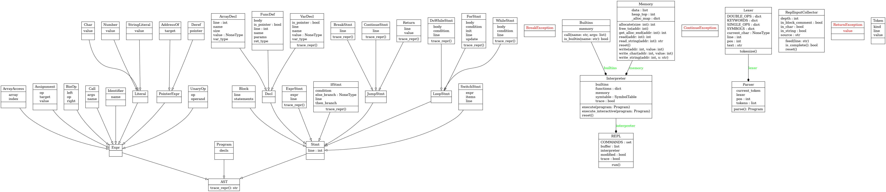

\newpage

# 摘要

本專題實作一個 Small-C 語言的互動式解譯器（Interactive Interpreter），以純 Python 3 撰寫，不依賴任何第三方套件。解譯器採用經典的四階段管線架構：前處理（Preprocessor）→ 詞法分析（Lexer）→ 語法分析（Parser）→ 樹狀走訪直譯（Tree-Walking Interpreter），並提供完整的 REPL（Read-Eval-Print Loop）操作介面，支援程式的互動輸入、載入、編輯、執行與除錯追蹤。

本報告詳細說明各模組的設計決策與實作細節、符號表與記憶體模型的資料結構設計、測試策略與結果分析，以及開發過程中遭遇的技術困難與解決方案。

\newpage

# 系統架構設計說明

## 模組劃分

整個解譯器共分為七個 Python 模組，各司其職：

| 模組 | 職責 |
|------|------|
| `main.py` | 程式進入點，啟動 REPL |
| `lexer.py` | 前處理（`#define` 展開）與詞法分析 |
| `parser.py` | AST 節點定義與遞迴下降語法分析 |
| `interpreter.py` | 樹狀走訪直譯器，執行 AST |
| `memory.py` | 線性記憶體模型與 `int32()` 工具函式 |
| `symtable.py` | 作用域堆疊式符號表 |
| `builtins_funcs.py` | 全部內建函式的實作 |
| `repl.py` | REPL 迴圈、環境指令分派、多行輸入收集 |

圖 1 為各模組的相依關係圖：


從圖中可見，`repl.py` 是整合核心，它依賴 `interpreter.py`；而 `interpreter.py` 再依賴 `parser.py`、`memory.py`、`symtable.py` 與 `builtins_funcs.py`。`lexer.py` 被 `parser.py` 使用，`memory.py` 被 `symtable.py` 與 `builtins_funcs.py` 共用。

## 資料流程

原始碼從輸入到輸出，嚴格單向流動：

```
使用者輸入（REPL）或 LOAD 指令
        │
        ▼
  preprocess()          ─── #define 巨集展開
        │
        ▼
  Lexer.tokenize()      ─── 字元掃描 → Token 串流
        │
        ▼
  Parser.parse()        ─── 遞迴下降 → AST
        │
        ▼
  Interpreter.execute() ─── 走訪 AST → 產生輸出
        │
        ▼
   stdout 輸出
```

互動模式（直接在提示符下輸入語句）走 `execute_interactive()` 路徑，跳過「必須有 `main()`」的限制；`RUN` 指令走 `execute()` 路徑，要求程式含有 `main()` 函式作為進入點。

## 類別結構

圖 2 為各模組中主要類別與 AST 節點的完整類別圖：



AST 節點分為三個層次：
- **`Expr`** 子類別：`BinOp`、`UnaryOp`、`Assignment`、`Call`、`Identifier`、`Number`、`Char`、`StringLiteral`、`AddressOf`、`Deref`、`ArrayAccess`
- **`Stmt`** 子類別：`ExprStmt`、`IfStmt`、`WhileStmt`、`DoWhileStmt`、`ForStmt`、`BreakStmt`、`ContinueStmt`、`Return`、`SwitchStmt`、`VarDecl`、`ArrayDecl`、`Block`
- **頂層節點**：`FuncDef`、`Program`

\newpage

# 各模組設計決策與實作細節

## lexer.py — 詞法分析器

### 前處理：`preprocess()`

在詞法分析之前，先以 `preprocess()` 處理 `#define` 巨集。設計決策：

- **識別字邊界感知替換**：不用簡單的字串取代（避免把 `MAX_SIZE` 中的 `MAX` 誤換），而是以手工分詞方式逐字元掃描，僅在完整識別字邊界上進行替換。
- **字串與字元字面量豁免**：掃描時追蹤是否處於雙引號（字串）或單引號（字元）內部，若在其中則不進行替換，避免污染字串內容。
- **行號補償**：`#define` 行被移除後，後續行號會偏移。透過在移除的位置插入空行保持行號一致，確保錯誤訊息中的行號對應原始輸入。

### 詞法掃描：`Lexer.tokenize()`

採用手工撰寫的字元掃描器（character scanner）：

- **雙字元運算子優先**：在識別單字元運算子前，先嘗試匹配雙字元運算子（如 `==`、`!=`、`<=`、`>=`、`<<`、`>>`、`++`、`--`），避免歧義。
- **Token 類型**：關鍵字（`if`、`while`、`int` 等）、識別字（`IDENT`）、整數常數（`NUMBER`，支援十六進位 `0x`/`0X` 前綴）、字元常數（`CHAR`，支援 `\n`、`\t`、`\0`、`\\`、`\'`、`\"`）、字串字面量（`STRING`）、運算子與分隔符。
- **每個 Token 攜帶行號**：`Token(kind, value, line)` 的 `line` 欄位在語法錯誤回報中使用。

## parser.py — 語法分析器與 AST

### AST 節點設計

所有 AST 節點繼承自 `AST` 基底類別，並各自實作 `trace_repr()` 方法，用於 `TRACE` 模式顯示人可讀的描述字串（如 `while (i < 10)`、`x = 5`），而非 Python `repr()`。

### 遞迴下降語法分析

`Parser` 類別以遞迴下降法（Recursive Descent Parsing）實作，表達式優先順序由低到高共 13 層：

```
assignment → logic_or → logic_and → bit_or → bit_xor → bit_and
→ equality → relational → shift → additive → multiplicative
→ unary → primary
```

每一層對應一個私有方法（如 `_assignment()`、`_logic_or()` …），僅在必要時呼叫下一層，自然表達優先順序。

### 函式定義與變數宣告的歧義消解

語法上，`int foo(...)` 與 `int foo;` 的開頭相同，無法僅憑一個 Token 區分。`is_func_def()` 方法進行 3–4 個 Token 的前瞻（lookahead）：

1. 確認第一個 Token 是型別關鍵字。
2. 確認第二個 Token 是識別字（函式或變數名稱）。
3. 確認第三個 Token（跳過可能的 `*`）是 `(`，以此判斷為函式定義。

## interpreter.py — 樹狀走訪直譯器

### 兩種執行模式

- **`execute(program)`**：用於 `RUN` 指令，要求程式頂層含有 `main()` 函式。先掃描頂層節點，收集所有函式定義存入 `self.funcs` 字典、執行全域變數宣告，最後呼叫 `main()`。
- **`execute_interactive(program)`**：用於 REPL 互動輸入，直接執行片段程式碼，不要求 `main()`，函式定義會累積在 `self.funcs` 中跨行保留。

### 控制流程以 Python 例外實作

`break`、`continue`、`return` 不以旗標或全域狀態傳遞，而是以 Python 例外機制實作：

| Small-C 語句 | 拋出例外 | 捕捉位置 |
|-------------|---------|---------|
| `break` | `BreakException` | `while` / `for` / `do-while` 的執行迴圈 |
| `continue` | `ContinueException` | 同上 |
| `return expr` | `ReturnException(value)` | `_eval_call()` 函式呼叫點 |

此設計的優點是程式碼簡潔——不需要在每個遞迴呼叫中傳遞「是否需要中斷」的狀態，結構清晰地反映了 C 語言控制流程的語意。

### 整數截斷

所有整數運算結果在寫入記憶體前，統一透過 `int32()` 截斷為 32 位元有號整數，模擬 C 語言的整數溢位行為。`int32()` 定義在 `memory.py` 作為模組層級函式，由 `interpreter.py` 與 `builtins_funcs.py` 直接 import 使用，避免散落的行內遮罩（如 `& 0xFFFFFFFF`）。

## memory.py — 記憶體模型

詳見第四章「記憶體模型的模擬方式」。

## symtable.py — 符號表

詳見第三章「符號表的資料結構設計」。

## builtins_funcs.py — 內建函式

`Builtins` 類別以一個 `_dispatch` 字典將函式名稱映射到對應的私有方法，供 `Interpreter._eval_call()` 查詢：

```python
self._dispatch = {
    'printf':  self._printf,
    'scanf':   self._scanf,
    'strlen':  self._strlen,
    'sqrt':    self._sqrt,
    ...
}
```

設計決策：

- **統一參數型別**：所有內建函式接收已求值的整數引數；字串引數以記憶體位址傳遞，由內建函式內部呼叫 `memory.read_string(addr)` 轉為 Python 字串。
- **`printf` 格式碼**：手工解析格式字串，支援 `%d`、`%c`、`%s`、`%x`、`%%`，不支援欄位寬度等進階格式，符合作業規格。
- **`scanf`**：以 Python `input()` 讀取整行，再依格式碼解析，將結果寫入指標所指位址。
- **錯誤處理**：`sqrt()` 負數引數、`mod()` 除零均拋出 `RuntimeError`，訊息格式符合評分規格。

## repl.py — 互動式介面

### 多行輸入收集：`ReplInputCollector`

為了支援跨行輸入函式定義（如 `APPEND` 模式），`ReplInputCollector` 維護三個狀態：

1. **大括號深度**（`brace_depth`）：追蹤 `{` / `}` 的巢狀層次，深度歸零時代表一個完整的結構輸入完畢。
2. **字串狀態**（`in_string`）：處於雙引號內時，`{` / `}` 不計入深度。
3. **字元狀態**（`in_char`）：處於單引號內時同理。

### else 跨行偵測

互動模式下，使用者可能分行輸入：
```
sc> if (x > 0) {
>     printf("pos\n");
> } else {
```

REPL 在 `{` 深度歸零後不立即執行，而是記錄為 `pending_source`，在下一行輸入後先檢查是否以 `else` 開頭，若是則繼續收集。

### 環境指令

REPL 支援 16 個大小寫不敏感的環境指令（`LOAD`、`SAVE`、`LIST`、`EDIT`、`DELETE`、`INSERT`、`APPEND`、`NEW`、`RUN`、`CHECK`、`TRACE`、`VARS`、`FUNCS`、`ABOUT`、`HELP`、`QUIT`/`EXIT`），以 `dispatch` 字典分派，架構清晰、易於擴充。

\newpage

# 符號表的資料結構設計

## 概觀

符號表（`symtable.py`）負責管理 Small-C 程式執行期間所有變數的名稱、型別與記憶體位址的對應關係。它刻意與記憶體讀寫分離：符號表只管「名稱→位址」的對映，實際的數值讀寫一律委派給 `Memory` 模組。

## Symbol 類別

`Symbol` 是符號表的基本單元，儲存一個變數的完整後設資料：

```
Symbol
├── name       : str    變數名稱
├── var_type   : str    型別（'int' / 'char' / 'void'）
├── addr       : int    在 Memory 中的起始位址
├── is_pointer : bool   是否為指標型別（宣告帶 *）
├── is_array   : bool   是否為陣列型別（宣告帶 []）
└── array_size : int    陣列元素數量（非陣列時為 0）
```

## 作用域堆疊

`SymbolTable` 以 `list[dict]` 實作作用域堆疊：

```
scopes = [
    { 'x': Symbol, 'arr': Symbol, ... },   ← scopes[0]：全域作用域（永久存在）
    { 'a': Symbol, 'temp': Symbol, ... },  ← scopes[1]：第一層函式呼叫
    { 'i': Symbol, ... },                  ← scopes[2]：巢狀函式呼叫
]
```

- **`push_scope()`**：函式呼叫時新增一層空字典。
- **`pop_scope()`**：函式返回時移除最內層；全域作用域（`scopes[0]`）永遠不被移除。
- **`lookup(name)`**：從 `scopes[-1]` 往 `scopes[0]` 逐層搜尋，自動實現 C 語言的變數遮蔽（shadowing）行為。

## 變數宣告流程

```
declare('x', 'int')
    │
    ├─ 確認同作用域無同名變數
    ├─ memory.allocate(1)  → 取得位址 addr
    ├─ memory.write(addr, 0)  → 初始化為 0
    └─ 建立 Symbol，存入 scopes[-1]
```

陣列宣告（`declare_array`）則一次配置連續的 `size` 個記憶體單元，所有位置初始化為 0。

## 數值讀寫的型別感知

`set_value()` 在寫入時依型別選擇截斷方式：

- `char`（非指標）：呼叫 `memory.write_char()`，截斷為 8 位元有號整數（-128 ～ 127）。
- 其他型別（含指標）：呼叫 `memory.write()`，截斷為 32 位元有號整數。

此設計確保 `char` 型別的語意正確，不需要在直譯器的每個賦值處另行判斷。

\newpage

# 記憶體模型的模擬方式

## 設計概觀

`Memory` 類別以一個固定大小的 Python `list[int]`（預設 65,536 個單元）模擬 Small-C 的記憶體空間。每個列表元素代表一個記憶體單元，可儲存 `int` 或 `char` 的數值。

## Bump Allocator（線性堆疊配置器）

記憶體管理採用最簡單且高效的 bump allocator：

```
記憶體空間：
  [0]  [1][2]...[N]  [N+1]...[M]  [M+1]...
   ↑                   ↑
  NULL                heap_top（下次配置起點）
（保留，不使用）
```

- **`allocate(size)`**：從 `heap_top` 開始配置 `size` 個連續單元，回傳起始位址，並將 `heap_top` 往後移動 `size`。時間複雜度 O(1)。
- **`free_to(addr)`**：將 `heap_top` 回退到指定位址，一次性釋放其上方的所有空間。在函式返回時，直譯器記錄呼叫前的 `heap_top`，返回後呼叫 `free_to()` 批次釋放區域變數，無需逐一追蹤。

## NULL 指標保留

位址 0 被保留作為 NULL 指標，`heap_top` 從 1 開始。所有指標解參考操作若位址為 0，直譯器拋出 `Runtime error: null pointer dereference`。

## 資料型別的模擬

| Small-C 型別 | 記憶體單元數 | 寫入方式 | 有效範圍 |
|-------------|------------|---------|---------|
| `int` | 1 | `write()` + `int32()` | −2,147,483,648 ～ 2,147,483,647 |
| `char` | 1 | `write_char()` | −128 ～ 127 |
| `int*` / `char*` | 1 | `write()` | 整數位址值 |
| `int[N]` | N | 各元素獨立 `write()` | 同 `int` |

## int32() 的設計

```python
def int32(value: int) -> int:
    value = int(value)
    return ((value + 2**31) % 2**32) - 2**31
```

此函式利用模運算將任意整數截斷到 32 位元有號整數範圍，正確處理 Python 大整數的溢位行為，避免使用位元遮罩（`& 0xFFFFFFFF`）後再補號的繁瑣寫法。作為模組層級函式，可直接被 `interpreter.py` 和 `builtins_funcs.py` import 使用。

## C 字串的模擬

字串以 C 風格的 null 終止序列（null-terminated string）儲存：

```
"hello"  →  ['h','e','l','l','o','\0']
            addr  addr+1 addr+2 ...   addr+5
```

- **`write_string(addr, s)`**：將 Python 字串逐字元寫入記憶體，並在末尾附加 `\0`（值為 0）。
- **`read_string(addr)`**：從位址開始讀取，直到遇到值為 0 的單元，回傳 Python 字串。字元值以 `chr(ch & 0xFF)` 轉換，正確處理負值 char。

\newpage

# 測試策略與測試結果分析

## 測試集設計策略

測試集位於 `tests/` 目錄，共 10 個 `.sc` 測試程式，每個配有對應的 `.expected` 預期輸出檔。`.expected` 由輔助腳本 `tests/gen_expected.py` 從解譯器實際執行結果自動產生，確保預期輸出與解譯器行為一致。

測試涵蓋五大類別：

### 類別一：基本算術與變數操作

**`test_01_arithmetic.sc`**：驗證所有算術運算子（`+`、`-`、`*`、`/`、`%`）、位元運算子（`&`、`|`、`^`、`<<`、`>>`）及複合賦值運算子（`+=`、`-=`、`*=`、`/=`、`%=`）的求值正確性。整數除法取整行為（10 / 3 = 3）是重點驗證項目。

**`test_02_variables.sc`**：驗證 `int`/`char` 型別宣告、十六進位字面值（`0xFF = 255`）、字元輸出（`%c`），以及 `abs`、`max`、`min`、`pow`、`sqrt`、`sizeof_int`、`sizeof_char` 等內建數學與工具函式。

### 類別二：控制結構

**`test_03_control_if.sc`**：以 `sign()` 函式驗證 `if / else if / else` 鏈式結構，搭配 `&&` 邏輯運算子驗證 `in_range()` 判斷，涵蓋正、零、負三個分支。

**`test_04_control_loop.sc`**：以同樣的累加問題（1 到 5 的總和 = 15）分別用 `while`、`for`、`do-while` 三種迴圈驗證，再測試 `break`（超過 5 停止）與 `continue`（跳過偶數）的行為。

### 類別三：函式定義與遞迴呼叫

**`test_05_functions.sc`**：驗證帶回傳值的函式（`add`、`multiply`、`gcd`）與 `void` 函式（`print_parity`），測試函式呼叫、參數傳遞（call by value）與多層呼叫。

**`test_06_recursion.sc`**：以階乘（`factorial`）、費氏數列（`fibonacci`）、次方（`power`）三個遞迴函式驗證遞迴呼叫堆疊與基本情況（base case）的正確性。

### 類別四：陣列與指標操作

**`test_07_array.sc`**：驗證陣列宣告、索引存取、陣列傳入函式（以指標形式）、線性搜尋（回傳找到的索引或 -1）、透過元素交換實作的反轉。

**`test_08_pointer.sc`**：驗證取址運算子（`&`）、解參考（`*`）、指標賦值（`p = &x; *p = 99`）、透過指標偏移訪問陣列（`*(arr + i)`），以及以指標傳遞實作 bubble sort。

### 類別五：錯誤處理驗證

**`test_09_error_runtime.sc`**：程式在正常執行一段輸出後，刻意呼叫 `safe_div(10, 0)` 觸發除以零錯誤。預期輸出包含正常執行的兩行輸出，最後一行為 `Error: Runtime error: division by zero.`，驗證錯誤訊息格式與程式即時中止的行為。

**`test_10_error_syntax.sc`**：程式碼含有兩處刻意的語法錯誤（缺少分號、缺少右括號）。預期輸出為 `Error: Syntax error at line 9: unexpected token 'int', expected 'SEMI'.`，驗證語法錯誤的偵測與行號回報。

## 測試結果

所有 10 個測試均通過，實際輸出與 `.expected` 完全一致。部分代表性結果：

| 測試 | 重點驗證 | 結果 |
|------|---------|------|
| `test_01` | 10 >> 1 = 5，a %= 4 = 0 | 通過 |
| `test_03` | `else if` 三向分支 | 通過 |
| `test_06` | factorial(7) = 5040，F(14) = 377 | 通過 |
| `test_08` | `*p = 99` 正確改變原變數 | 通過 |
| `test_09` | 除以零後程式中止，不輸出後續行 | 通過 |

\newpage

# 開發過程中遭遇的主要困難及其解決方案

## 困難一：`#define` 展開誤入字串字面量

**問題描述**：早期 `preprocess()` 使用 Python 的 `str.replace()` 進行巨集替換，導致 `printf("MAX = %d\n")` 中的字串若恰好包含巨集名稱的子字串也會被錯誤替換。

**解決方案**：改以手工逐字元掃描，維護 `in_string` 與 `in_char` 狀態旗標，僅在不處於字串或字元字面量內時才進行替換，並加上識別字邊界檢查（前後字元不是字母、數字或底線），確保完整詞彙匹配。

## 困難二：`#define` 行刪除造成行號偏移

**問題描述**：`preprocess()` 直接刪除 `#define` 所在行後，後續錯誤訊息的行號相對原始輸入產生偏移（每刪除一行，其後的行號少 1）。

**解決方案**：不刪除 `#define` 行，而是將其替換為等長的空行（保持原始行數不變），使 Lexer 產生的行號與使用者看到的原始碼行號一一對應。

## 困難三：互動模式下 `else` 跨行被誤判為獨立語句

**問題描述**：使用者在 REPL 中分行輸入 `if { ... }` 後換行，再輸入 `else { ... }`。`ReplInputCollector` 在大括號深度歸零後立即送出，導致 `else` 出現在獨立的解析輪次中，造成語法錯誤。

**解決方案**：在大括號深度歸零後，不立即送出原始碼，而是存入 `pending_source`。下一行輸入到來時，先檢查其是否以 `else` 開頭（去除空白後比對）；若是，則將兩段合併繼續收集；若否，先執行 `pending_source`，再處理新的一行。

## 困難四：記憶體釋放與多次 `RUN` 的狀態殘留

**問題描述**：早期設計在每次 `RUN` 之間未完整重置 `Memory` 與 `SymbolTable`，導致多次 `RUN` 時全域變數殘留前次執行的數值，`heap_top` 持續增長最終耗盡記憶體。

**解決方案**：`REPL._cmd_run()` 在每次執行前呼叫 `interpreter.reset()`，後者依序重置 `Memory`（清零陣列、`heap_top` 歸 1）與 `SymbolTable`（清空所有 scope，重建空的全域作用域），確保每次 `RUN` 從乾淨狀態開始。

## 困難五：`Block` 記憶體洩漏

**問題描述**：函式內的 `Block`（大括號區塊）執行完畢後，其中宣告的區域變數未及時釋放，`heap_top` 只增不減。

**解決方案**：在進入 `Block` 執行前記錄 `save_top = memory.heap_top`，執行完畢後呼叫 `memory.free_to(save_top)`，無論正常結束或例外（`break`/`continue`/`return`）均在 `finally` 區塊中執行釋放，防止洩漏。

\newpage

# 工作分配與貢獻說明

本專題為個人獨立完成。以下為各階段的工作內容說明：

| 開發階段 | 內容 | 對應模組 |
|---------|------|---------|
| 詞法分析 | Token 定義、字元掃描器、`#define` 前處理 | `lexer.py` |
| 語法分析 | 所有 AST 節點類別設計、遞迴下降 Parser | `parser.py` |
| 記憶體模型 | `Memory`、`int32()`、bump allocator | `memory.py` |
| 符號表 | `Symbol`、`SymbolTable`、作用域堆疊 | `symtable.py` |
| 直譯器核心 | `Interpreter`、控制流程例外、兩種執行模式 | `interpreter.py` |
| 內建函式 | 全部 22 個內建函式（I/O、字串、數學、工具） | `builtins_funcs.py` |
| REPL | 指令分派、多行收集、`else` 跨行偵測 | `repl.py` |
| 測試 | 10 個測試程式與預期輸出 | `tests/` |
| 報告 | 本技術報告 | `docs/report.md` |

\newpage

# 附錄：Small-C 語言支援範圍摘要

## 支援的語言特性

- **資料型別**：`int`（32 位元有號）、`char`（8 位元有號）、`int*`、`char*`（指標）
- **字面值**：十進位整數、十六進位整數（`0x`/`0X`）、字元（含跳脫序列）、字串
- **變數**：全域與區域變數宣告（含初始化）、一維陣列
- **運算子**：算術、位元、邏輯、比較、前置 `++`/`--`、複合賦值（`+=`、`-=`、`*=`、`/=`、`%=`）、取址（`&`）、解參考（`*`）
- **控制結構**：`if`/`else if`/`else`、`while`、`do-while`、`for`、`break`、`continue`、`return`、`switch`/`case`（bonus）
- **函式**：定義、呼叫、遞迴、call by value、指標參數
- **前處理**：無參數 `#define` 巨集展開
- **內建函式**：22 個（I/O、字串處理、數學、記憶體與工具）

## 不支援的特性

`float`/`double`、`struct`/`union`/`typedef`、多維陣列、後置 `++`/`--`、函式式巨集、`#include`、前向宣告
