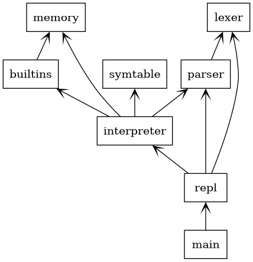
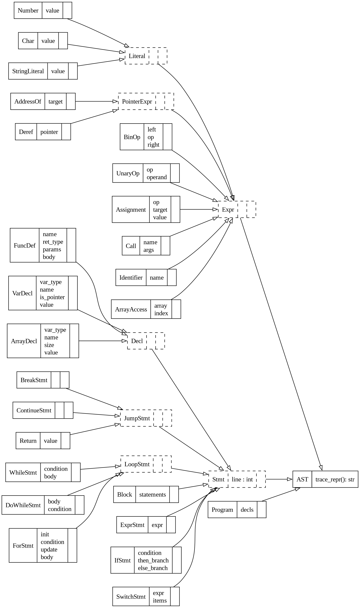
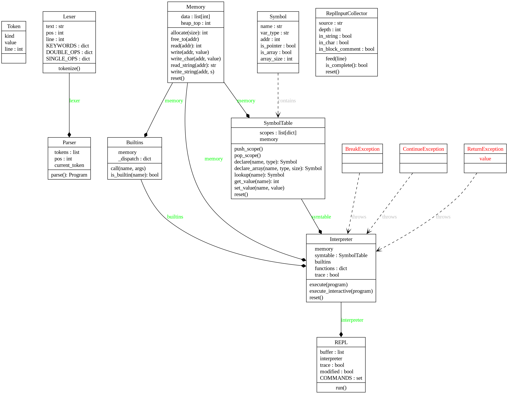

\newpage

# 摘要

本專題實作一個 Small-C 語言的互動式解譯器（Interactive Interpreter），以純 Python 3 撰寫，不依賴任何第三方套件。解譯器採用經典的四階段管線架構：前處理（Preprocessor）→ 詞法分析（Lexer）→ 語法分析（Parser）→ 樹狀走訪直譯（Tree-Walking Interpreter），並提供完整的 REPL（Read-Eval-Print Loop）操作介面，支援程式的互動輸入、載入、編輯、執行與除錯追蹤。

本報告詳細說明各模組的設計決策與實作細節、符號表與記憶體模型的資料結構設計、測試策略與結果分析，以及開發過程中遭遇的技術困難與解決方案。

\newpage

# 系統架構設計說明

## 模組劃分

整個解譯器共分為七個 Python 模組，各司其職：

- **`main.py`**：程式進入點，建立並啟動 `REPL` 物件。

- **`lexer.py`**：詞法分析層。`preprocess()` 負責展開無參數 `#define` 巨集；`Lexer.tokenize()` 逐字元掃描，將原始碼轉為 `Token` 串流供 Parser 消費。

- **`parser.py`**：語法分析層，包含兩大部分：上半部定義所有 AST 節點類別（`Expr`、`Stmt` 及其子類別），下半部實作遞迴下降 Parser，將 Token 串流轉為抽象語法樹（AST）。

- **`interpreter.py`**：直譯執行層。走訪 Parser 產生的 AST，以 Python 例外實作 `break`／`continue`／`return` 控制流程，支援完整程式執行（`execute`）與互動片段執行（`execute_interactive`）兩種模式。

- **`memory.py`**：記憶體模型。以固定大小的整數陣列模擬線性記憶體空間，提供 bump allocator 進行配置與釋放；模組層級的 `int32()` 函式負責 32 位元整數截斷，供其他模組共用。

- **`symtable.py`**：符號表。以作用域堆疊（`list[dict]`）管理變數名稱與記憶體位址的對映，實現 C 語言的區域／全域作用域與變數遮蔽行為。

- **`builtins_funcs.py`**：內建函式庫。以分派字典實作全部 22 個內建函式，包含輸出入（`printf`、`scanf`）、字串處理（`strlen`、`strcpy` 等）、數學運算（`abs`、`sqrt` 等）及工具函式（`atoi`、`itoa` 等）。

- **`repl.py`**：互動介面。`ReplInputCollector` 追蹤大括號深度與字串狀態，收集跨行輸入；`REPL` 以分派字典處理 16 個環境指令，並處理互動模式下的 `else` 跨行銜接問題。

圖一為各模組的相依關係圖：

{ width=75% }

由圖中可見各模組的依賴關係如下：

- `repl.py` 是整合核心，依賴 `interpreter.py` 執行程式。
- `interpreter.py` 依賴 `parser.py`（取得 AST）、`memory.py`（記憶體讀寫）、`symtable.py`（符號查詢）與 `builtins_funcs.py`（內建函式）。
- `parser.py` 依賴 `lexer.py` 取得 Token 串流。
- `memory.py` 被 `symtable.py` 與 `builtins_funcs.py` 共用，是底層的共享資源。

\FloatBarrier

## 資料流程

原始碼從輸入到輸出，嚴格單向流動：

```
使用者輸入（REPL）或 LOAD 指令
        │
        ▼
  preprocess()          ─── #define 巨集展開
        │
        ▼
  Lexer.tokenize()      ─── 字元掃描 → Token 串流
        │
        ▼
  Parser.parse()        ─── 遞迴下降 → AST
        │
        ▼
  Interpreter.execute() ─── 走訪 AST → 產生輸出
        │
        ▼
   stdout 輸出
```

互動模式（直接在提示符下輸入語句）走 `execute_interactive()` 路徑，跳過「必須有 `main()`」的限制；`RUN` 指令走 `execute()` 路徑，要求程式含有 `main()` 函式作為進入點。

\FloatBarrier

## 類別結構

AST 節點分為三個層次：

- **頂層節點**
    - `Program`：整份程式的根節點，包含所有頂層宣告
    - `FuncDef`：函式定義，含名稱、回傳型別、參數列表與函式本體

- **`Expr`（運算式）子類別**
    - 算術／邏輯：`BinOp`（二元運算）、`UnaryOp`（一元運算）
    - 賦值：`Assignment`（含複合賦值 `+=` 等）
    - 呼叫：`Call`（函式呼叫）
    - 基本值：`Identifier`（識別字）、`Number`（整數）、`Char`（字元）、`StringLiteral`（字串）
    - 指標：`AddressOf`（取址 `&`）、`Deref`（解參考 `*`）、`ArrayAccess`（陣列索引）

- **`Stmt`（陳述式）子類別**
    - 區塊：`Block`（大括號區塊）
    - 選擇：`IfStmt`（if/else）、`SwitchStmt`（switch/case）
    - 迴圈：`WhileStmt`、`DoWhileStmt`、`ForStmt`
    - 跳躍：`BreakStmt`、`ContinueStmt`、`Return`
    - 宣告：`VarDecl`（變數宣告）、`ArrayDecl`（陣列宣告）
    - 其他：`ExprStmt`（運算式陳述式）

各模組中主要類別與 AST 節點的完整類別圖如下：

{ width=80% }

{ width=90% }

\newpage

# 各模組設計決策與實作細節

## lexer.py — 詞法分析器

### 前處理：`preprocess()`

在詞法分析之前，先以 `preprocess()` 處理 `#define` 巨集。設計決策：

- **識別字邊界感知替換**：不用簡單的字串取代（避免把 `MAX_SIZE` 中的 `MAX` 誤換），而是以手工分詞方式逐字元掃描，僅在完整識別字邊界上進行替換。
- **字串與字元字面量豁免**：掃描時追蹤是否處於雙引號（字串）或單引號（字元）內部，若在其中則不進行替換，避免污染字串內容。
- **行號補償**：`#define` 行被移除後，後續行號會偏移。透過在移除的位置插入空行保持行號一致，確保錯誤訊息中的行號對應原始輸入。

### 詞法掃描：`Lexer.tokenize()`

採用手工撰寫的字元掃描器（character scanner）：

掃描器的兩個關鍵設計：雙字元運算子（`==`、`!=`、`<=`、`<<` 等）優先於單字元匹配，避免歧義；每個 Token 攜帶行號供錯誤回報使用。產生的 Token 類型如下：

| Token 類型             | 範例                                        | 說明                               |
|:-----------------------|:--------------------------------------------|:-----------------------------------|
| 關鍵字                 | `int`、`if`、`while`、`return`              | 語言保留字                         |
| `IDENT`                | `foo`、`x`、`arr`                           | 識別字（變數／函式名稱）           |
| `NUMBER`               | `42`、`-7`、`0xFF`                          | 整數常數，支援十六進位             |
| `CHAR`                 | `'A'`、`'\n'`、`'\0'`                       | 字元常數，支援跳脫序列             |
| `STRING`               | `"hello\n"`                                 | 字串字面量                         |
| 運算子                 | `+`、`==`、`&&`、`<<`                       | 算術、邏輯、位元運算子             |
| 分隔符                 | `;`、`{`、`}`                               | 陳述式與區塊邊界                   |

## parser.py — 語法分析器與 AST

### AST 節點設計

所有 AST 節點繼承自 `AST` 基底類別，並各自實作 `trace_repr()` 方法，用於 `TRACE` 模式顯示人可讀的描述字串（如 `while (i < 10)`、`x = 5`），而非 Python `repr()`。

### 遞迴下降語法分析

`Parser` 類別以遞迴下降法（Recursive Descent Parsing）實作，表達式優先順序由低到高共 13 層：

```
assignment → logic_or → logic_and → bit_or → bit_xor → bit_and
→ equality → relational → shift → additive → multiplicative
→ unary → primary
```

每一層對應一個私有方法（如 `_assignment()`、`_logic_or()` …），僅在必要時呼叫下一層，自然表達優先順序。

### 函式定義與變數宣告的歧義消解

語法上，`int foo(...)` 與 `int foo;` 的開頭相同，無法僅憑一個 Token 區分。`is_func_def()` 方法進行 3–4 個 Token 的前瞻（lookahead）：

1. 確認第一個 Token 是型別關鍵字。
2. 確認第二個 Token 是識別字（函式或變數名稱）。
3. 確認第三個 Token（跳過可能的 `*`）是 `(`，以此判斷為函式定義。

## interpreter.py — 樹狀走訪直譯器

### 兩種執行模式

- **`execute(program)`**：用於 `RUN` 指令，要求程式頂層含有 `main()` 函式。先掃描頂層節點，收集所有函式定義存入 `self.funcs` 字典、執行全域變數宣告，最後呼叫 `main()`。
- **`execute_interactive(program)`**：用於 REPL 互動輸入，直接執行片段程式碼，不要求 `main()`，函式定義會累積在 `self.funcs` 中跨行保留。

### 控制流程以 Python 例外實作

`break`、`continue`、`return` 不以旗標或全域狀態傳遞，而是以 Python 例外機制實作：

| Small-C 語句              | 拋出例外                     | 捕捉位置                                     |
|:--------------------------|:-----------------------------|:---------------------------------------------|
| `break`                   | `BreakException`             | `while` / `for` / `do-while` 的執行迴圈     |
| `continue`                | `ContinueException`          | 同上                                         |
| `return expr`             | `ReturnException(value)`     | `_eval_call()` 函式呼叫點                    |

此設計的優點是程式碼簡潔——不需要在每個遞迴呼叫中傳遞「是否需要中斷」的狀態，結構清晰地反映了 C 語言控制流程的語意。

### 整數截斷

所有整數運算結果在寫入記憶體前，統一透過 `int32()` 截斷為 32 位元有號整數，模擬 C 語言的整數溢位行為。`int32()` 定義在 `memory.py` 作為模組層級函式，由 `interpreter.py` 與 `builtins_funcs.py` 直接 import 使用，避免散落的行內遮罩（如 `& 0xFFFFFFFF`）。

## memory.py — 記憶體模型

詳見第四章「記憶體模型的模擬方式」。

## symtable.py — 符號表

詳見第三章「符號表的資料結構設計」。

## builtins_funcs.py — 內建函式

`Builtins` 類別以一個 `_dispatch` 字典將函式名稱映射到對應的私有方法，供 `Interpreter._eval_call()` 查詢：

```python
self._dispatch = {
    'printf':  self._printf,
    'scanf':   self._scanf,
    'strlen':  self._strlen,
    'sqrt':    self._sqrt,
    ...
}
```

設計決策：

- **統一參數型別**：所有內建函式接收已求值的整數引數；字串引數以記憶體位址傳遞，由內建函式內部呼叫 `memory.read_string(addr)` 轉為 Python 字串。
- **`printf` 格式碼**：手工解析格式字串，支援 `%d`、`%c`、`%s`、`%x`、`%%`，不支援欄位寬度等進階格式，符合作業規格。
- **`scanf`**：以 Python `input()` 讀取整行，再依格式碼解析，將結果寫入指標所指位址。
- **錯誤處理**：`sqrt()` 負數引數、`mod()` 除零均拋出 `RuntimeError`，訊息格式符合評分規格。

## repl.py — 互動式介面

### 多行輸入收集：`ReplInputCollector`

為了支援跨行輸入函式定義（如 `APPEND` 模式），`ReplInputCollector` 維護三個狀態：

| 狀態欄位                   | 作用                             | 影響                                       |
|:--------------------------|:---------------------------------|:-------------------------------------------|
| `depth`（大括號深度）      | 追蹤 `{` / `}` 巢狀層次          | 歸零時視為輸入完整                         |
| `in_string`               | 是否處於雙引號字串內             | 為真時 `{` / `}` 不計入深度               |
| `in_char`                 | 是否處於單引號字元內             | 同上，避免誤計                             |

### else 跨行偵測

互動模式下，使用者可能分行輸入：
```
sc> if (x > 0) {
>     printf("pos\n");
> } else {
```

REPL 在 `{` 深度歸零後不立即執行，而是記錄為 `pending_source`，在下一行輸入後先檢查是否以 `else` 開頭，若是則繼續收集。

### 環境指令

REPL 支援 16 個大小寫不敏感的環境指令，以 `dispatch` 字典分派：

| 類別               | 指令                                                     | 功能                                         |
|:-------------------|:---------------------------------------------------------|:---------------------------------------------|
| 程式管理           | `LOAD`、`SAVE`、`NEW`                                    | 載入檔案、儲存緩衝區、清空狀態               |
| 緩衝區編輯         | `LIST`、`EDIT`、`DELETE`、`INSERT`、`APPEND`             | 檢視與修改緩衝區內容                         |
| 執行與檢查         | `RUN`、`CHECK`                                           | 執行程式、僅做語法檢查                       |
| 除錯               | `TRACE`、`VARS`、`FUNCS`                                 | 追蹤模式、顯示變數、顯示函式清單             |
| 系統               | `ABOUT`、`HELP`、`QUIT`/`EXIT`                           | 版本資訊、說明、離開                         |

\newpage

# 符號表的資料結構設計

## 概觀

符號表（`symtable.py`）負責管理 Small-C 程式執行期間所有變數的名稱、型別與記憶體位址的對應關係。它刻意與記憶體讀寫分離：符號表只管「名稱→位址」的對映，實際的數值讀寫一律委派給 `Memory` 模組。

## Symbol 類別

`Symbol` 是符號表的基本單元，儲存一個變數的完整後設資料：

| 欄位               | 型別     | 說明                                                    |
|:-------------------|:---------|:--------------------------------------------------------|
| `name`             | `str`    | 變數名稱                                                |
| `var_type`         | `str`    | 型別（`'int'`、`'char'`、`'void'`）                     |
| `addr`             | `int`    | 在 `Memory` 中的起始位址                                |
| `is_pointer`       | `bool`   | 是否為指標型別（宣告帶 `*`）                            |
| `is_array`         | `bool`   | 是否為陣列型別（宣告帶 `[]`）                           |
| `array_size`       | `int`    | 陣列元素數量；非陣列時為 0                              |

## 作用域堆疊

`SymbolTable` 以 `list[dict]` 實作作用域堆疊：

```
scopes = [
    { 'x': Symbol, 'arr': Symbol, ... },   ← scopes[0]：全域作用域（永久存在）
    { 'a': Symbol, 'temp': Symbol, ... },  ← scopes[1]：第一層函式呼叫
    { 'i': Symbol, ... },                  ← scopes[2]：巢狀函式呼叫
]
```

- **`push_scope()`**：函式呼叫時新增一層空字典。
- **`pop_scope()`**：函式返回時移除最內層；全域作用域（`scopes[0]`）永遠不被移除。
- **`lookup(name)`**：從 `scopes[-1]` 往 `scopes[0]` 逐層搜尋，自動實現 C 語言的變數遮蔽（shadowing）行為。

## 變數宣告流程

```
declare('x', 'int')
    │
    ├─ 確認同作用域無同名變數
    ├─ memory.allocate(1)  → 取得位址 addr
    ├─ memory.write(addr, 0)  → 初始化為 0
    └─ 建立 Symbol，存入 scopes[-1]
```

陣列宣告（`declare_array`）則一次配置連續的 `size` 個記憶體單元，所有位置初始化為 0。

## 數值讀寫的型別感知

`set_value()` 在寫入時依型別選擇截斷方式：

- `char`（非指標）：呼叫 `memory.write_char()`，截斷為 8 位元有號整數（-128 ～ 127）。
- 其他型別（含指標）：呼叫 `memory.write()`，截斷為 32 位元有號整數。

此設計確保 `char` 型別的語意正確，不需要在直譯器的每個賦值處另行判斷。

\newpage

# 記憶體模型的模擬方式

## 設計概觀

`Memory` 類別以一個固定大小的 Python `list[int]`（預設 65,536 個單元）模擬 Small-C 的記憶體空間。每個列表元素代表一個記憶體單元，可儲存 `int` 或 `char` 的數值。

## Bump Allocator（線性堆疊配置器）

記憶體管理採用最簡單且高效的 bump allocator：

```
記憶體空間：
  [0]  [1][2]...[N]  [N+1]...[M]  [M+1]...
   ↑                   ↑
  NULL                heap_top（下次配置起點）
（保留，不使用）
```

- **`allocate(size)`**：從 `heap_top` 開始配置 `size` 個連續單元，回傳起始位址，並將 `heap_top` 往後移動 `size`。時間複雜度 O(1)。
- **`free_to(addr)`**：將 `heap_top` 回退到指定位址，一次性釋放其上方的所有空間。在函式返回時，直譯器記錄呼叫前的 `heap_top`，返回後呼叫 `free_to()` 批次釋放區域變數，無需逐一追蹤。

## NULL 指標保留

位址 0 被保留作為 NULL 指標，`heap_top` 從 1 開始。所有指標解參考操作若位址為 0，直譯器拋出 `Runtime error: null pointer dereference`。

## 資料型別的模擬

| Small-C 型別         | 記憶體單元數    | 寫入方式                  | 有效範圍                                  |
|:---------------------|:----------------|:--------------------------|:------------------------------------------|
| `int`                | 1               | `write()` + `int32()`     | −2,147,483,648 ～ 2,147,483,647           |
| `char`               | 1               | `write_char()`            | −128 ～ 127                               |
| `int*` / `char*`     | 1               | `write()`                 | 整數位址值                                |
| `int[N]`             | N               | 各元素獨立 `write()`      | 同 `int`                                  |

## int32() 的設計

```python
def int32(value: int) -> int:
    value = int(value)
    return ((value + 2**31) % 2**32) - 2**31
```

此函式利用模運算將任意整數截斷到 32 位元有號整數範圍，正確處理 Python 大整數的溢位行為，避免使用位元遮罩（`& 0xFFFFFFFF`）後再補號的繁瑣寫法。作為模組層級函式，可直接被 `interpreter.py` 和 `builtins_funcs.py` import 使用。

## C 字串的模擬

字串以 C 風格的 null 終止序列（null-terminated string）儲存：

```
"hello"  →  ['h','e','l','l','o','\0']
            addr  addr+1 addr+2 ...   addr+5
```

- **`write_string(addr, s)`**：將 Python 字串逐字元寫入記憶體，並在末尾附加 `\0`（值為 0）。
- **`read_string(addr)`**：從位址開始讀取，直到遇到值為 0 的單元，回傳 Python 字串。字元值以 `chr(ch & 0xFF)` 轉換，正確處理負值 char。

\newpage

# 測試策略與測試結果分析

## 測試集設計策略

測試集位於 `tests/` 目錄，共 10 個 `.sc` 測試程式，每個配有對應的 `.expected` 預期輸出檔。`.expected` 由輔助腳本 `tests/gen_expected.py` 從解譯器實際執行結果自動產生，確保預期輸出與解譯器行為一致。

測試涵蓋五大類別，共 10 個測試程式：

| 測試程式                    | 類別           | 驗證重點                                                                 |
|:----------------------------|:---------------|:-------------------------------------------------------------------------|
| `test_01_arithmetic.sc`     | 基本算術       | 算術、位元、複合賦值運算子；整數除法取整（10/3=3）                       |
| `test_02_variables.sc`      | 基本算術       | `int`/`char` 宣告、十六進位字面值、`abs`/`max`/`sqrt` 等內建函式        |
| `test_03_control_if.sc`     | 控制結構       | `if`/`else if`/`else` 鏈式分支、`&&` 邏輯運算子                         |
| `test_04_control_loop.sc`   | 控制結構       | `while`/`for`/`do-while` 三種迴圈、`break`、`continue`                  |
| `test_05_functions.sc`      | 函式與遞迴     | 帶回傳值函式、`void` 函式、call by value、多層呼叫                       |
| `test_06_recursion.sc`      | 函式與遞迴     | 遞迴階乘、費氏數列、次方；遞迴基本情況（base case）                      |
| `test_07_array.sc`          | 陣列與指標     | 陣列宣告、索引存取、線性搜尋、透過指標傳入函式                           |
| `test_08_pointer.sc`        | 陣列與指標     | 取址 `&`、解參考 `*`、指標賦值、指標偏移、bubble sort                   |
| `test_09_error_runtime.sc`  | 錯誤處理       | 執行期除以零錯誤；驗證訊息格式與程式即時中止                             |
| `test_10_error_syntax.sc`   | 錯誤處理       | 語法錯誤偵測（缺少 `;`）；驗證行號回報格式                               |

## 測試結果

所有 10 個測試均通過，實際輸出與 `.expected` 完全一致。部分代表性結果：

| 測試         | 重點驗證                                                          | 結果   |
|:-------------|:------------------------------------------------------------------|:-------|
| `test_01`    | 10 >> 1 = 5，a %= 4 = 0                                          | 通過   |
| `test_03`    | `else if` 三向分支                                                | 通過   |
| `test_06`    | factorial(7) = 5040，F(14) = 377                                  | 通過   |
| `test_08`    | `*p = 99` 正確改變原變數                                          | 通過   |
| `test_09`    | 除以零後程式中止，不輸出後續行                                    | 通過   |

\newpage

# 開發過程中遭遇的主要困難及其解決方案

開發過程中遭遇的五個主要問題整理如下：

| 困難                          | 問題根源                                                                         | 解決方案                                                                              |
|:------------------------------|:---------------------------------------------------------------------------------|:--------------------------------------------------------------------------------------|
| `#define` 展開誤入字串        | 使用 `str.replace()` 不感知字串邊界，導致字串內的子字串也被替換                  | 改為逐字元掃描，追蹤 `in_string`/`in_char` 狀態，加識別字邊界檢查                   |
| `#define` 行刪除造成行號偏移  | 直接刪除 `#define` 行使後續行號少 1                                              | 改為將 `#define` 行替換為空行，保持行數不變                                           |
| 互動模式 `else` 跨行誤判      | 大括號歸零後立即送出，`else` 進入下一輪解析造成語法錯誤                          | 歸零後先存入 `pending_source`，下一行若以 `else` 開頭則合併繼續收集                  |
| 多次 `RUN` 狀態殘留           | 每次執行未重置 `Memory` 與 `SymbolTable`，全域變數與 `heap_top` 持續累積         | `RUN` 前呼叫 `interpreter.reset()`，清零記憶體並重建空的全域作用域                   |
| `Block` 記憶體洩漏            | 大括號區塊結束後區域變數未釋放，`heap_top` 只增不減                              | 進入 `Block` 前記錄 `save_top`，`finally` 區塊中呼叫 `free_to(save_top)`             |

\newpage

# 工作分配與貢獻說明

本專題為個人獨立完成。以下為各階段的工作內容說明：

| 開發階段               | 內容                                                       | 對應模組               |
|:-----------------------|:-----------------------------------------------------------|:-----------------------|
| 詞法分析               | Token 定義、字元掃描器、`#define` 前處理                   | `lexer.py`             |
| 語法分析               | 所有 AST 節點類別設計、遞迴下降 Parser                     | `parser.py`            |
| 記憶體模型             | `Memory`、`int32()`、bump allocator                        | `memory.py`            |
| 符號表                 | `Symbol`、`SymbolTable`、作用域堆疊                        | `symtable.py`          |
| 直譯器核心             | `Interpreter`、控制流程例外、兩種執行模式                  | `interpreter.py`       |
| 內建函式               | 全部 22 個內建函式（I/O、字串、數學、工具）                | `builtins_funcs.py`    |
| REPL                   | 指令分派、多行收集、`else` 跨行偵測                        | `repl.py`              |
| 測試                   | 10 個測試程式與預期輸出                                    | `tests/`               |
| 報告                   | 本技術報告                                                 | `docs/report.md`       |

\newpage

# 附錄：Small-C 語言支援範圍摘要

## 支援的語言特性

| 類別               | 支援內容                                                                                                   |
|:-------------------|:-----------------------------------------------------------------------------------------------------------|
| 資料型別           | `int`（32 位元有號）、`char`（8 位元有號）、`int*`、`char*`（指標）                                       |
| 字面值             | 十進位整數、十六進位（`0x`/`0X`）、字元（含 `\n`/`\t`/`\0` 等跳脫序列）、字串                            |
| 變數               | 全域與區域變數宣告（含初始化）、一維陣列                                                                   |
| 運算子             | 算術、位元、邏輯、比較、前置 `++`/`--`、複合賦值（`+=`/`-=`/`*=`/`/=`/`%=`）、取址 `&`、解參考 `*`      |
| 控制結構           | `if`/`else if`/`else`、`while`、`do-while`、`for`、`break`、`continue`、`return`、`switch`/`case`（bonus）|
| 函式               | 定義、呼叫、遞迴、call by value、指標參數                                                                  |
| 前處理             | 無參數 `#define` 巨集展開                                                                                  |
| 內建函式           | 22 個（I/O、字串處理、數學運算、記憶體與工具）                                                             |

## 不支援的特性

| 類別               | 不支援項目                                                                      |
|:-------------------|:--------------------------------------------------------------------------------|
| 資料型別           | `float`、`double`、`long`、`short`、`unsigned`                                  |
| 型別系統           | `struct`、`union`、`enum`、`typedef`、多層指標（`int**`）                       |
| 陣列               | 多維陣列                                                                        |
| 運算子             | 後置 `++`/`--`                                                                  |
| 前處理器           | 函式式巨集、`#include`                                                          |
| 函式               | 前向宣告                                                                        |
